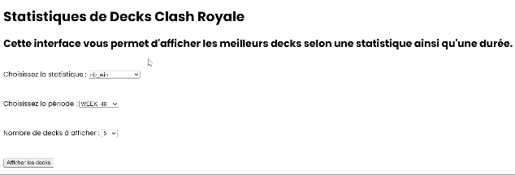

# Projet Clash Royale

L’objectif de ce projet est de concevoir un système d’analyse de combinaison de cartes pour le jeu vidéo Clash Royale. Dans ce jeu chaque joueur possède un ensemble de cartes (96 maximum) et il doit en choisir 8 pour constituer un «deck» qui lui permettra d’affronter un adversaire qui lui aussi possède un deck de 8 cartes.

Nous avons enregistré près de 2.000.000 de parties de ce jeu dans notre master dataset, nous disposons pour chaque partie du deck de chaque joueur ainsi que des informations sur le niveau d’expérience des joueurs mais aussi sur le niveau moyen des cartes des decks.

L’objectif du projet est d’obtenir un système similaire à celui proposé ici:
https://royaleapi.com/decks/popular pour aider les joueurs à choisir les meilleurs combinaisons de
cartes à jouer.

## I. MapReduce/HBase

### Compilation 
Pour compiler le projet, exécutez la commande suivante dans le répertoire racine du projet : 

```bash
  mvn clean package
```

### Exécution sur la passerelle
Avant d'exécuter le programme MapReduce/HBase, assurez-vous d'accéder à la passerelle avec la commande :

```bash
  ssh -X idnum@147.210.117.54
```

Ensuite, utilisez la commande suivante pour lancer le programme MapReduce avec YARN :

```bash
  yarn jar ClashRoyaleProject-0.0.1.jar [options]
```

#### Options disponibles
* -__mapreduce : Effectue uniquement les traitements MapReduce.
* -__hbase__: Initialise uniquement la base de données HBase.
* -__k [valeur]__: Spécifie la valeur de k pour le traitement TopK (10 par défaut).
* -__default: Effectue les deux traitements.
* -__h__: Affiche l'aide

Assurez-vous d'exécuter la commande suivante pour configurer les dépendances HBase :

```bash
  export HADOOP_CLASSPATH=`hadoop classpath`:`hbase mapredcp`:/etc/hbase/conf:/usr/hdp/3.0.0.0-1634/hbase/lib/*
```

Si vous choisissez d'initialiser la base de données, modifiez l'ID utilisateur (idnum) dans le fichier HBase.java, champ TABLE_NAME.

### Résultats

Après l'exécution, un dossier "PLE" est créé avec deux sous-dossiers :

* __resultat_brut__ : Contient les résultats bruts du traitement MapReduce.
* __resultTopK__ : Contient les résultats finaux avec la sélection TopK.

### Visualisation de la base de données HBase

Si la base de données HBase a été initialisée, vous pouvez visualiser son contenu en utilisant la commande HBase Shell :

```bash
  hbase shell
```

Ensuite, pour voir les données dans la table spécifiée, utilisez la commande HBase appropriée (veuillez vérifier le nom de la table dans votre application).

```bash
  scan 'idnum:CRdata'
```

## II. Interface Web pour l'affichage des données

### Lancement du serveur 
Pour pouvoir lancer le serveur web, utilisez la commande suivante sur la passerelle (transférez d'abord les fichiers JS dessus) :

```bash
  node app.js
```

Il faudra télécharger au préalable les packages suivant depuis la passerelle : 


```bash
  npm install express
  npm install hbase
  npm install krb5
```

Le serveur est maintenant lancé, il suffit de lancer firefox via la commande :
```bash
  firefox
```

Si il y a des erreurs pour lancer le navigateur, n'oubliez pas d'utiliser la commande -X avec ssh pour vous connecter sur la passerelle.

### Demo


